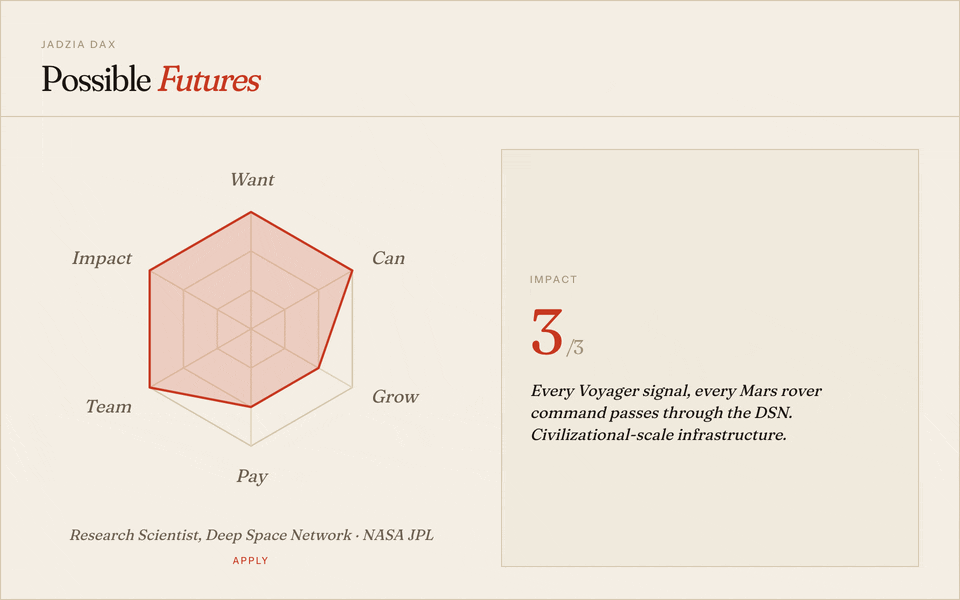

# Possible Futures

_A local-first tool for evaluating job postings against a career compass you control. A futures tool for your own path._

AI is used on both sides of the hiring process now. It reads your resume, ranks you, and decides whether a human ever sees your application. This tool puts equivalent machinery on your side of the table. You describe who you are and what you want in your own words. Possible Futures reads every posting against that description and tells you which roles are actually worth your attention, and how to frame yourself for each one without hollowing out your voice.

Runs entirely on your laptop. Your career history never leaves your machine.

**Prefer a visual tour?** [View the slide deck →](https://kandizzy.github.io/possible-futures/)



_Every job posting is scored on six dimensions — Want, Can, Grow, Pay, Team, Impact — against your personal compass. The shape tells you whether to apply, stretch, or skip._

## Quick start

```bash
mkdir career && cd career
git clone https://github.com/kandizzy/possible-futures.git
cd possible-futures
npm install
cp .env.local.example .env.local   # then add your ANTHROPIC_API_KEY
npm run dev
```

Open **http://localhost:3000** and follow the first-run intake. Five short chapters, about ten minutes, and you walk out with a working career compass composed in real time.

### The 5-chapter intake

1. **Setup** — the basics: your name, the title you want to be read as, the shape of your search.
2. **Throughline** — the thread that runs through everything you've done. The story you want the AI to tell on your behalf.
3. **What you're looking for** — signal words, salary floor, location constraints, the roles you'd actually say yes to.
4. **What you won't tolerate** — red flag words, dealbreakers, and any context you'd rather keep private (a caregiving year, a health break, a quiet sabbatical) so the AI doesn't drag it into a cover letter.
5. **Shelf of proof** — the roles, projects, and artifacts that back the throughline up.

At the end, the intake compiles three working documents and saves them to both the database and your `career/` folder so you own portable copies:

- **Book** — your full career history, the context the AI reads before every call.
- **Compass** — what you're looking for and what you're avoiding.
- **Playbook** — your writing rules and resume versions.

## What it does

- **Evaluate** job postings on six dimensions (Want, Can, Grow, Pay, Team, Impact) against your personal rubric
- **Discover companies** worth watching and build out your target list
- **Track the pipeline** — applications, status, resume version used, next steps, contact reminders
- **Export ATS-friendly PDFs** of cover letters and tailored resumes that follow your writing rules
- **Revise your intake anytime** — edit your Book, Compass, or Playbook and the app recompiles
- **Calibrate over time** — override any AI score with a reason and corrections feed back as few-shot examples
- **Stay local-first** — SQLite on disk, markdown in your folder, nothing synced anywhere

## Prerequisites

- **Node.js 22+** — Node 22 is the current Active LTS. Newer majors (23, 24) often work but may lack prebuilt binaries for `better-sqlite3`, which drops you into a slow from-source build. Stick with 22 unless you have a reason not to.
- **One of these** for AI features:
  - An [Anthropic API key](https://platform.claude.com/) (pay-per-use, ~$0.10/evaluation with Sonnet)
  - [Claude CLI](https://docs.anthropic.com/en/docs/claude-code) installed with a Max/Pro subscription (free per-use)
  - A local model server like [LM Studio](https://lmstudio.ai/) or [Ollama](https://ollama.com/) (zero per-call cost, data never leaves your laptop). Tested working with Gemma 4 E4B; larger models will score with more nuance. Load the model with a context length of **32K or higher** because each scoring call sends the full Book + Compass (~30–40K tokens) to the model. Configure in Settings → AI Backend → Local model.

### Using nvm

The repo ships an `.nvmrc` pinned to `22`. If you have [nvm](https://github.com/nvm-sh/nvm) (macOS / Linux / WSL) or [nvm-windows](https://github.com/coreybutler/nvm-windows) (Windows) installed:

```bash
cd possible-futures
nvm install      # one-time, installs the version in .nvmrc
nvm use          # switches to it for this shell
node -v          # should print v22.x.x
```

_Windows note:_ nvm-windows doesn't read `.nvmrc` automatically. Run `nvm install 22` and `nvm use 22` instead.

If you don't have nvm installed yet, follow the official install guide for your operating system:

- **macOS / Linux / WSL** — [nvm installation steps](https://github.com/nvm-sh/nvm#installing-and-updating)
- **Windows** — [nvm-windows installation steps](https://github.com/coreybutler/nvm-windows#installation--upgrades)

After installing, restart your shell (or open a new terminal) and come back to the commands above.

## Folder structure

The app expects to live inside a parent folder (we use `career/` in the quick start) where the three generated markdown files also live:

```
career/
├── [Your_Name]_Possible_Futures.md   ← your Book (career history)
├── JOB_SEARCH_COMPASS.md             ← your Compass (what you want)
├── APPLICATION_PLAYBOOK.md           ← your Playbook (writing rules)
├── versions/
│   ├── resume-a.md                   ← base resume for Version A
│   ├── resume-b.md                   ← base resume for Version B
│   ├── ...                           ← one per version defined in the Playbook
│   └── {company-role}/               ← generated per application
│       ├── cover_letter.md
│       ├── resume.md
│       └── resume_summary.md
└── possible-futures/                 ← this project
    ├── src/
    ├── scripts/
    ├── data/                         ← SQLite database (created on first run)
    └── ...
```

The intake writes these files for you. If you already have a Book of your own, see the Advanced section below.

## What you'll see

**Dashboard** — A catalog of every evaluated role, with the strongest fits (total score 15+) drawn in stamp red so your eye finds them first and the rest set in ordinary ink. Filter by status or company.

**Evaluate** — Paste a job posting, get a 6-dimension breakdown with rationale for each score, matched signal/red flag words, a fit summary, and a resume version recommendation.

**Role Detail** — The full analysis. Click "edit" on any score to override it with your own score and a reason. These corrections get fed back to the AI as few-shot examples. Includes gap analysis with skill gaps, severity levels, and project ideas.

**Materials** — Click "Draft Materials" on any role to generate a cover letter and resume that follow your Playbook rules. Export ATS-friendly PDFs. In full mode, generates a complete two-page resume. In summary mode, generates a cover letter and summary, then combines the summary with your base resume.

**Applications** — Track submitted applications with status (Applied, Interviewing, Offer, Rejected, Ghosted, Withdrawn), resume version used, and notes. Ghosted is a first-class status since that's the most common outcome these days.

**Calibrations** — See all your score corrections over time. The app detects patterns like "you consistently score Want lower than the AI on pure engineering roles."

**Companies / People** — Your watchlists from the Compass. People get amber dots when you haven't contacted them in 30+ days. Mark someone as "contacted today," add notes, edit URLs, and add new people directly from the page.

**Settings** — Toggle between Anthropic API and Claude CLI mode. Choose between full resume generation and summary-only mode. Revise your Book, Compass, or Playbook and refresh source files from disk.

## Gap analysis

Most ATS-style evaluators stop at "you're a 72% match." Possible Futures goes the other way: when it scores a role, it also surfaces specific gaps between your background and what the posting asks for — but only when the gaps are real. Strong fits return nothing, on purpose. That silence is the confirmation — you already have the skills this role needs.

For each gap the AI identifies, you get:

- **What's missing** — the specific skill, domain, or experience the role wants that your Book doesn't evidence.
- **Why it matters here** — framed against this posting, not gaps in the abstract. A missing Postgres keyword on a design role doesn't get flagged; missing it on an infra role does.
- **Relevant work already on hand** — named projects from your Book that partially address the gap, so you can decide whether to surface them in your resume or cover letter rather than assume the AI has done it for you.
- **Possible studies** — two or three concrete, buildable project ideas aimed at the specific gap. Not "learn Rust," but "Build a CLI that batch-renames files by EXIF date using the `kamadak-exif` crate."

The point is to turn a rejection risk into a weekend plan. Instead of learning you're not qualified, you learn what a qualified version of you would ship — and which pieces you've already built. Over time, the gaps that keep reappearing across roles are the ones actually worth closing.

Gap analysis shows up on the **Role Detail** page, below the score breakdown, under _Gaps & studies_.

## Revising your intake

You're not locked into the answers you gave on day one. From **Settings**, you can:

- Re-open any chapter of the intake and rewrite it.
- Edit the generated Book, Compass, or Playbook directly.
- Refresh the database from the markdown files on disk after editing them in your editor of choice.

Revisions don't wipe your application history. Roles, calibrations, and notes survive.

## Tech stack

| Layer     | Tool                        | Why                                                     |
| --------- | --------------------------- | ------------------------------------------------------- |
| Framework | Next.js 16 (App Router)     | Server components, server actions, no API routes needed |
| Database  | SQLite via better-sqlite3   | Zero config, single file, synchronous API               |
| AI        | Anthropic API or Claude CLI | API for structured JSON; CLI for Max/Pro subscribers    |
| Styling   | Tailwind v4 + custom theme  | Editorial paper-and-ink palette, Fraunces / Instrument Sans / JetBrains Mono, paper-grain overlay. See `/colophon` in the app for the full rationale. |
| Language  | TypeScript                  | Type safety across DB rows, API responses, and UI       |

## Architecture notes

**Server Actions instead of API routes.** This is a single-user local app, so we use Next.js server actions for all mutations. A form submission calls a function that runs on the server, writes to SQLite, and returns a result. No REST endpoints, no fetch calls, no CORS.

**SQLite as the only database.** No Postgres, no Docker, no migrations tool. The schema is a single `.sql` file that runs on first boot. Migrations are handled by a `migrate()` function that checks for missing columns. This is fine for a local tool.

**AI prompt design.** The scoring prompt includes ~80K tokens of context: your full career history, job search compass, application rules, and recent calibrations. This is the whole point. The AI scores well because it knows everything about you, not because it's clever about job postings in general.

**Calibration as few-shot learning.** When you override an AI score, the correction (with your reason) gets stored in the database. The next evaluation includes your 10 most recent corrections in the prompt as examples. This is few-shot learning without fine-tuning.

**Two AI backends.** The API mode uses the Anthropic SDK for structured JSON responses. The CLI mode shells out to `claude -p` and parses the text output. CLI mode is free with a Max subscription but slower and less reliable for JSON parsing.

## Environment variables

| Variable            | Required          | Default                           | Description                                                |
| ------------------- | ----------------- | --------------------------------- | ---------------------------------------------------------- |
| `ANTHROPIC_API_KEY` | Only for API mode | -                                 | Your Anthropic API key                                     |
| `ANTHROPIC_MODEL`   | No                | `claude-sonnet-4-20250514`        | Model to use for scoring and materials                     |
| `PROJECT_BOOK`      | No                | `[Your_Name]_Possible_Futures.md` | Filename of your Book in the parent directory (migration)  |

You can switch to CLI mode in Settings (http://localhost:3000/settings), which requires no API key.

## Common commands

```bash
npm run dev      # Start development server on port 3000
npm run build    # Production build (checks for type errors)
npm run lint     # Run ESLint
npm run test     # Run the Vitest suite
npm run seed     # Advanced: migrate existing markdown files into the database
```

## Backing up your data (read this before you need it)

You'll spend around thirty minutes on the intake and then quietly accumulate weeks of scored roles, score corrections, and application notes. Losing that would be awful. Here's how to make sure it can't happen — no terminal required.

### Think of `career/` as one thing

Everything you care about lives inside the parent `career/` folder you created in the quick start. The three markdown files (Book, Compass, Playbook) sit at the top level; the app and its database live in `career/possible-futures/`. If you back up the whole `career/` folder, you have everything. If you put it back somewhere else, the app just works.

### The easy way — let your cloud drive handle it

The lowest-effort backup is to keep the `career/` folder inside a synced cloud folder you already use: iCloud Drive, Dropbox, Google Drive, or OneDrive.

1. Open your file browser (Finder on Mac, File Explorer on Windows, Files on Linux).
2. Drag the `career/` folder into iCloud Drive (or Dropbox, etc.).
3. That's the whole step. Every change from now on is continuously backed up.

The app doesn't care where the folder lives — only that the three markdown files and `possible-futures/` still sit next to each other inside it.

**One caveat:** cloud sync works best when the app isn't actively writing. Quit the app (or let it sit idle for a minute) before you trust that the sync has caught up. Active SQLite writes create small helper files that cloud services occasionally trip over mid-write.

### A weekly dated snapshot (belt-and-suspenders)

If you want a second layer of safety, take a dated snapshot once a week:

1. Quit the app.
2. In your file browser, right-click the `career/` folder and choose **Compress** (Mac) or **Send to → Compressed folder** (Windows). You'll get a zip file.
3. Rename it with today's date: `career-2026-04-19.zip`.
4. Move the zip somewhere outside your working folder — an external drive, a separate cloud folder, wherever you keep other important archives.

Do this weekly, or before any change you're nervous about (rewriting your throughline, regenerating your Book, etc.).

### What's in the database vs. the markdown files

You don't need to think about this for backups — backing up the whole `career/` folder covers both. But if something ever goes wrong, it helps to know which piece is which:

| In the database (`data/job-search.db`) | In the markdown files                   |
| -------------------------------------- | --------------------------------------- |
| AI-scored roles with rationales        | Your career history (Book)              |
| Your score overrides + reasons         | Signal/red flag words (Compass)         |
| Application statuses and notes         | Company and people watchlists (Compass) |
| Generated cover letters and summaries  | Writing rules (Playbook)                |
| Calibration history                    | Pre-scored roles (Compass)              |

**If you ever have to choose which to rescue first, rescue the markdown files.** They're the thirty minutes you spent on the intake. The database can be partially rebuilt from them with `npm run seed`; the markdown files can't be rebuilt from anything.

### Restoring from a backup

- **Whole folder lost or corrupted.** Put your backup `career/` folder back where it was. Start the app the normal way. Everything is exactly as you left it.
- **Just the markdown files lost.** Copy them from your backup into `career/`. The app keeps running.
- **Just the database lost.** Copy it from your backup into `career/possible-futures/data/`. If you don't have a database backup but still have the markdown files, run `npm run seed` from inside `possible-futures/` to rebuild scoring state. You'll lose scoring corrections and application statuses, but your compass is intact.
- **Moving to a new laptop.** Copy the entire `career/` folder to the new machine. Install Node (see Prerequisites), then inside `possible-futures/` run `npm install` and `npm run dev`. Your whole history moves with you.

### A note on what's inside your backup

⚠️ Your backup includes your `.env.local` file with your Anthropic API key. That's convenient for restore but means you should treat the backup itself as sensitive — keep it in a personal cloud folder, not a shared one, and don't email the zip to yourself.

Your backup will also include `node_modules/` — several hundred megabytes of installable dependencies. It's safe to exclude from manual zips to save space; running `npm install` inside `possible-futures/` after restore rebuilds it in a minute or two. Cloud services sync it fine but it does eat storage quota, so keep an eye on that if you're close to a plan limit.

### If you prefer the terminal

```bash
# Timestamped copy of just the database
cp data/job-search.db "data/backup-$(date +%Y%m%d).db"

# Zip the whole career folder from its parent
cd ~/path/to/career/..
zip -r "career-$(date +%Y%m%d).zip" career/

# Restore a specific database snapshot
cp data/backup-20260419.db data/job-search.db
```

## Advanced: migrating from existing markdown files

If you already have a career history document (a Book, career narrative, or similar) and want to skip the in-app intake:

1. Place your file in the parent directory as `[Your_Name]_Possible_Futures.md`.
2. Set `PROJECT_BOOK` in `.env.local` to the filename.
3. Add a `JOB_SEARCH_COMPASS.md` and `APPLICATION_PLAYBOOK.md` alongside it. The structure the parser expects is documented in `scripts/seed.ts` and `src/lib/parsers/`.
4. Run `npm install` from inside `possible-futures/` if you haven't already.
5. Run `npm run seed` to load the markdown files into the database.
6. Start the app with `npm run dev`.

Most users should use the in-app intake instead. It produces the same files in the correct format with no hand-editing.

## Troubleshooting

**"ANTHROPIC_API_KEY not set" error** — Either add your key to `.env.local` or switch to CLI mode in Settings.

**Evaluate page hangs** — The AI call takes 15-30 seconds because it sends ~80K tokens of context. If it takes longer than 60 seconds, check the terminal for errors. CLI mode is slower than API mode.

**"Claude CLI not found"** — If using CLI mode, install Claude Code: `npm install -g @anthropic-ai/claude-code`. Or switch to API mode.

**Scores seem wrong** — That's the point of calibration. Override any score you disagree with and explain why. After 10-15 corrections, the AI should be scoring closer to how you would.

## Future: from few-shot to fine-tuning

The calibration system builds a training dataset as you use it. Every time you override a score, you're creating a labeled example: posting in, corrected scores + reasoning out. After 50-100 corrections, that's enough to fine-tune a model that scores like you without needing 80K tokens of context per call.

**What that would look like:**

- Export calibrations + postings as JSONL training pairs
- Fine-tune on your scoring patterns (system: condensed rubric, user: posting, assistant: your corrected scores)
- The fine-tuned model internalizes your preferences, so you drop the Book from the prompt
- Faster responses, lower cost per evaluation

**Current limitation:** Claude fine-tuning is only available for Haiku through Amazon Bedrock in US West (Oregon). Not yet available through Anthropic's direct API. When that changes, this becomes a straightforward addition.

**The pattern generalizes.** The calibration loop (AI scores, human corrects with reasoning, corrections become few-shot examples, eventually become fine-tuning data) works for any domain where you want an AI to learn your judgment. Hiring, code review, content moderation, design critique — anywhere you have a rubric and opinions.

## Contributing

This started as a tool for my graduate students and for the people I keep watching get cut loose on LinkedIn. That's who it's for first. Contributions are welcome, but "contribution" here means more than upstream PRs.

**If you're here to adapt it for yourself or a classroom** — fork freely. Rip out what you don't need, change the aesthetic, rewrite the prompts in your own voice. The whole point is that your career compass is yours.

**If you're here to improve the main project** — patches, bug reports, and thoughtful issues are welcome.

- **Bugs and feature ideas** — open an issue at https://github.com/kandizzy/possible-futures/issues. Include your Node version, whether you're on API or CLI mode, and steps to reproduce.
- **Pull requests** — fork, branch from `main`, and keep changes scoped. One concern per PR. Run `npm run lint`, `npm run test`, and `npm run build` locally first and make sure all three pass.
- **Style** — match the editorial aesthetic already in place (see `/colophon` in the running app). New components should reuse the `paper`, `ink`, `rule`, and `stamp` theme tokens in `src/app/globals.css` rather than introduce raw hex colors.
- **Tests** — anything that touches scoring, parsing, or database queries should come with a Vitest test. The existing suites under `src/**/__tests__/` are the pattern to follow.
- **Scope** — deliberately local-first and single-user. Features that require a hosted backend, analytics, or multi-tenant state are out of scope. Features that reduce the emotional and cognitive load of a job search are very much in scope.

By submitting a contribution to the main project you agree to license it under the same terms as the project.

## License

[MIT](./LICENSE) © Carrie Kengle
